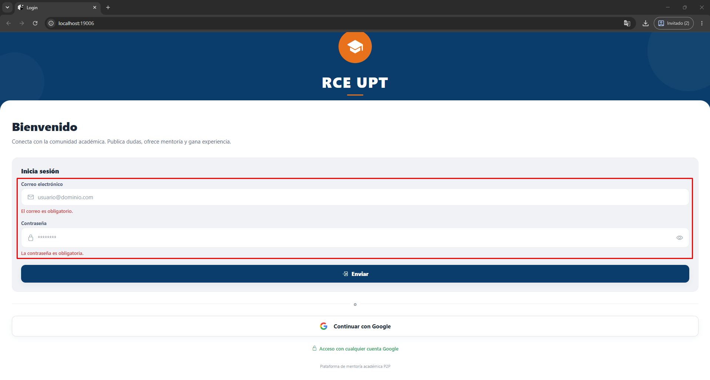
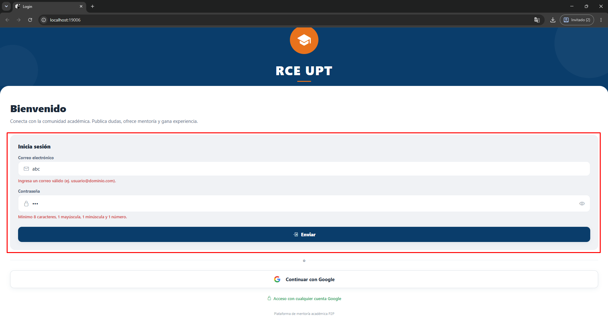
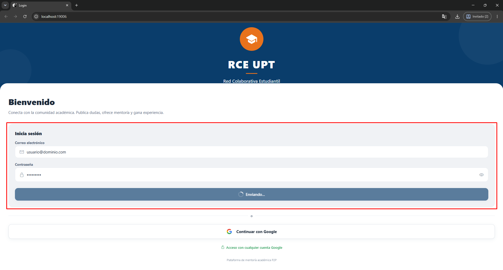

# SM2_EXAMEN_VALIDACIONES

## Información General

- **Nombre del curso:** [SOLUCIONES MÓVILES II]
- **Nombre completo del alumno:** [Augusto Joaquin Rivera Muñoz]
- **Código de estudiante:** [2022073505]
- **Fecha:** [02/06/2026]
- **Repositorio público (URL):** https://github.com/RiveraAugusto/SM2_EXAMEN_VALIDACIONES

## Detalle de la Implementación

### Pantalla seleccionada: Login (Inicio de sesión)

- **Ubicación:** `mobile/src/screens/LoginScreen.js`
- **Campos validados:** Correo electrónico y Contraseña.
- **Comportamiento de validación:**
  - La validación ocurre al presionar “Iniciar sesión” (se marca `submitAttempted = true`).
  - Si ya hubo intento de envío, la validación también se actualiza conforme el usuario escribe.
  - Los mensajes de error se muestran debajo de cada campo cuando hay error.
- **Simulación de envío (estado de carga/deshabilitado):**
  - Si el formulario es válido, se activa `formSubmitting = true`.
  - Se simula el envío durante **2 segundos** con `setTimeout`, mostrando estado de carga y deshabilitando edición.

### Reglas de validación y expresiones regulares (RegExp)

#### 1) Correo electrónico

- **RegExp usada (en el proyecto, JavaScript):**
  - `^[A-Z0-9._%+-]+@[A-Z0-9.-]+\.[A-Z]{2,}$` con flag `i` (no distingue mayúsculas/minúsculas).
- **Criterio:** Debe tener formato `usuario@dominio.com`.
- **Mensajes:**
  - Vacío: `El correo es obligatorio.`
  - Formato inválido: `Ingresa un correo válido (ej. usuario@dominio.com).`

**Equivalente en Dart (Flutter)**

```dart
final emailRegex = RegExp(
  r'^[A-Z0-9._%+-]+@[A-Z0-9.-]+\.[A-Z]{2,}$',
  caseSensitive: false,
);

String validateEmail(String value) {
  final trimmed = value.trim();
  if (trimmed.isEmpty) return 'El correo es obligatorio.';
  if (!emailRegex.hasMatch(trimmed)) {
    return 'Ingresa un correo válido (ej. usuario@dominio.com).';
  }
  return '';
}
```

#### 2) Contraseña

- **RegExp usada (en el proyecto, JavaScript):**
  - `^(?=.*[a-z])(?=.*[A-Z])(?=.*\d).{8,}$`
- **Criterios:**
  - Mínimo 8 caracteres
  - Al menos 1 letra minúscula
  - Al menos 1 letra mayúscula
  - Al menos 1 número
- **Mensajes:**
  - Vacío: `La contraseña es obligatoria.`
  - Incumple reglas: `Mínimo 8 caracteres, 1 mayúscula, 1 minúscula y 1 número.`

**Equivalente en Dart (Flutter)**

```dart
final passwordRegex = RegExp(r'^(?=.*[a-z])(?=.*[A-Z])(?=.*\d).{8,}$');

String validatePassword(String value) {
  if (value.isEmpty) return 'La contraseña es obligatoria.';
  if (!passwordRegex.hasMatch(value)) {
    return 'Mínimo 8 caracteres, 1 mayúscula, 1 minúscula y 1 número.';
  }
  return '';
}
```

## Evidencias de Funcionamiento (Capturas o GIFs)

### URLs locales (para tomar evidencias)

- **Frontend (web):** http://localhost:19006/
- **Backend (Swagger UI):** http://localhost:8000/docs

### Capturas requeridas

1) **Captura 1 (errores visibles):**
   - Deja campos vacíos o coloca datos inválidos y presiona “Iniciar sesión”.
   - Ejemplo de datos inválidos:
     - Email: `abc`
     - Password: `123`
   - Deben verse los mensajes debajo de cada campo.
   - Archivos a colocar aquí: `evidencias/Captura1.png` y `evidencias/Captura2.png`




2) **Captura 2 (datos válidos + envío simulado):**
   - Ingresa datos válidos y presiona “Iniciar sesión”.
   - Ejemplo de datos válidos:
     - Email: `usuario@dominio.com`
     - Password: `Password1`
   - Debe verse el botón en carga o los campos deshabilitados durante el envío simulado.
   - Archivo a colocar aquí: `evidencias/Captura3.png`


